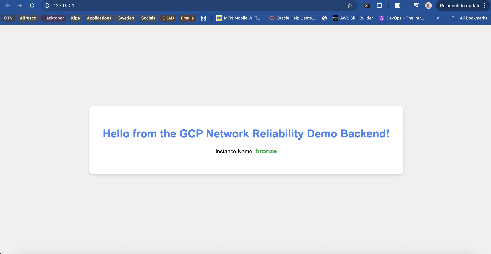
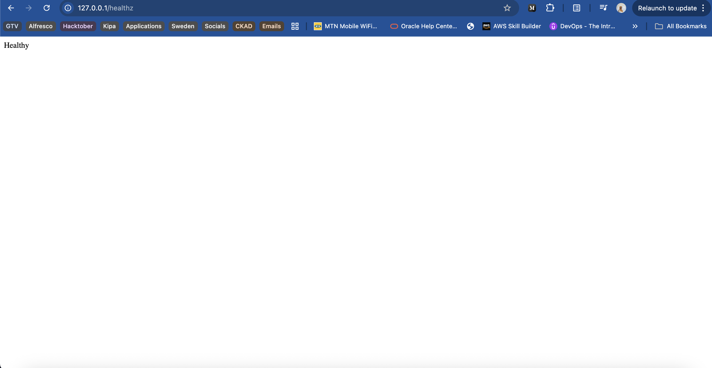

# GCP Network Reliability Demo

A hands-on demonstration of deploying a scalable, highly-available web application on Google Cloud Platform using enterprise-grade infrastructure components.

## Overview

This repository contains a simple Flask-based web application designed to demonstrate GCP's network reliability and load balancing capabilities. The application is deployed using a **Managed Instance Group (MIG)** behind a **Global External Application Load Balancer**, which represents the standard, enterprise-grade setup for production workloads on GCP.

## Architecture

The deployment architecture includes:

- **Flask Application**: A lightweight Python web server that displays the instance hostname and provides health check endpoints


- **Health Checks**: Ensures only healthy instances receive traffic


## Application Features

The Flask application includes two endpoints:

### Root Endpoint (`/`)
Returns an HTML page displaying:
- Welcome message
- The actual VM instance hostname (for easy identification across load-balanced instances)

### Health Check Endpoint (`/healthz`)
Returns HTTP 200 OK with "Healthy" status for load balancer health checks

## Prerequisites

- Google Cloud Platform account
- `gcloud` CLI installed and configured
- Python 3.7 or higher (for local testing)
- Appropriate GCP permissions to create:
  - Compute Engine instances
  - Instance templates and groups
  - Load balancers
  - Firewall rules

## Local Testing

```bash
# Install dependencies
pip install -r requirements.txt

# Run the application (requires sudo for port 80)
sudo python3 main.py

# Or run on a higher port without sudo
# Modify main.py to use port 8080, then:
python3 main.py
```

Access the application at `http://localhost` (or `http://localhost:8080` if using alternate port)


## License

MIT

## Contributing

Pull requests are welcome. For major changes, please open an issue first to discuss what you would like to change.
